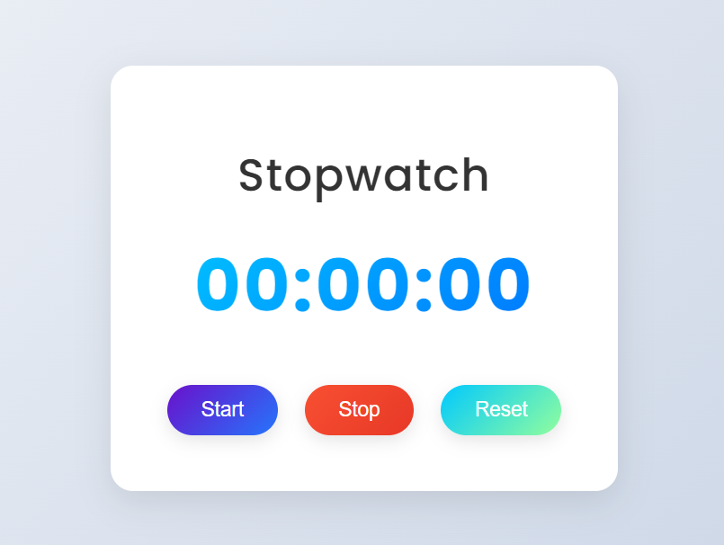

# Stopwatch Project with JavaScript, HTML, and CSS

This project is a simple stopwatch built with **JavaScript**, **HTML**, and **CSS**. It allows users to start, stop, and reset the timer. The design is modern and responsive, making it suitable for all devices.

## Table of Contents
- [ScreenShot](#screenshot)
- [Features](#features)
- [Prerequisites](#prerequisites)
- [Usage](#usage)
- [Contact](#contact)

## ScreenShot



<p align="right">(<a href="#table-of-contents">back to top</a>)</p>

### Built With

This project was built using the following technologies:

* 
* 
* 

<p align="right">(<a href="#table-of-contents">back to top</a>)</p>

## Features

- Modern and minimalistic design with neumorphism effects
- Start, stop, and reset the timer with easy-to-use buttons
- Responsive layout that adapts to different screen sizes
- Built with vanilla JavaScript, no dependencies or libraries
- Hover effects for better interactivity

<p align="right">(<a href="#table-of-contents">back to top</a>)</p>

## Prerequisites

To run this project, all you need is a browser that supports HTML, CSS, and JavaScript. No additional libraries or dependencies are required.

<p align="right">(<a href="#table-of-contents">back to top</a>)</p>

## Usage

1. Clone the project from GitHub or download the files:
   ```bash
   git clone https://github.com/AmirrezaAhmadi/StopWatch-App.git
2. Open the StopWatch.html file in your browser to start using the stopwatch.

<p align="right">(<a href="#table-of-contents">back to top</a>)</p>

## Contact

You can reach me through the following:

* Email: AmirrezaAhmadi.GH@Gmail.com
* Telegram: https://t.me/AmirrezaDevelop
* Instagram: https://www.instagram.com/codewithamirreza
* Project Link: https://github.com/AmirrezaAhmadi/StopWatch-App.git

<p align="right">(<a href="#table-of-contents">back to top</a>)</p>
